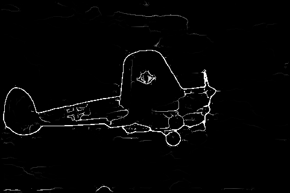
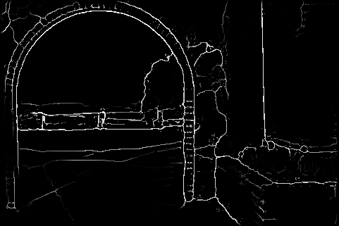
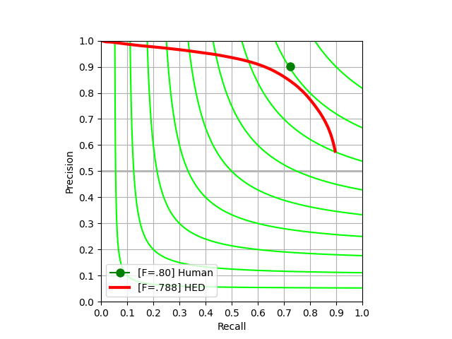

## Edge Eval Python
A python implementation of [edge eval](https://github.com/s9xie/hed_release-deprecated/tree/master/examples/eval).

The logic of the code is almost the same as that of the origin MATLAB implementation (see [References](#References)).

## Requirements
* Python3
* Numpy
* Scipy >= 1.6.0
* g++
* Matplotlib

## Install
### 1. clone repository
``` shell
git clone https://github.com/Walstruzz/edge_eval_python.git
cd edge_eval_python
```

### 2. compile cxx library
Most of the code in this folder is copied from [davidstutz/extended-berkeley-segmentation-benchmark](https://github.com/davidstutz/extended-berkeley-segmentation-benchmark/tree/master/source).

Actually, there is a more efficient function in `Scipy` that can solve the CSA problem without compiling the following cxx codes...
``` shell
cd cxx/src
source build.sh
```

## Usage
### 1. save your results
``` python
from scipy.io import savemat

key = "result"
result = your_method(image)
savemat(save_name, {key: image})
```

### 2.eval
``` shell
python main.py --alg "HED" --model_name_list "hed" --result_dir examples/hed_result \
--save_dir examples/hed_eval_result --gt_dir examples/bsds500_gt --key result \
--file_format .mat --workers -1
```

## Result(BSDS 500)






|  ODS  |  OIS  |  AP   | R50   |
|-------|-------|-------|-------|
| 0.789 | 0.806 | 0.810 | 0.897 |


## Note
* Because of the difference in calculation precision and the sensitivity of NMS threshold, the edge images may be **slightly** different.
* `match_edge_maps` samples points randomly (**so as Matlab**).
* Python and Matlab index files in different order, resulting in different order of `eval_bdry_img.txt`.
* Python version is slower than Matlab version. Should I implement more functions in `cxx/lib/solve_cas.so`?

## References
* [edge eval](https://github.com/s9xie/hed_release-deprecated/tree/master/examples/eval)
* [extended-berkeley-segmentation-benchmark](https://github.com/davidstutz/extended-berkeley-segmentation-benchmark).
* [bwmorph_thin](https://gist.github.com/joefutrelle/562f25bbcf20691217b8)
* [pdollar's image & video Matlab toolbox ](https://github.com/pdollar/toolbox)
* [pdollar's edge detection toolbox](https://github.com/pdollar/edges)
* [PyTorch Reimplementation of HED](https://github.com/xwjabc/hed)
